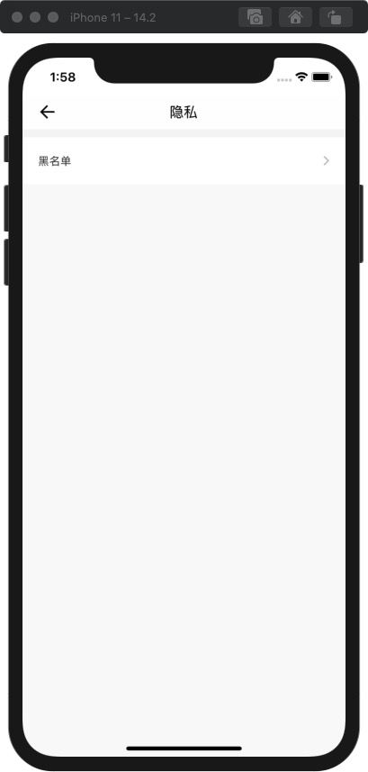

# SimpleChat

## 项目环境

+ 操作系统：iOS 10.0+
+ 开发工具：Xcode 12.2 (Xcode 12+)
+ 使用语言：Object-C

## 运行

在SimpleChat文件夹下打开终端，输入`pod install`，点击`SimpleChat.xcworkspace`进入xcode，点击运行按钮即可启动项目。

## 可能出现问题

运行时，如果这段代码出现错误：

```objc
if(scene.activationState == UISceneActivationStateForegroundActive) {
    if(@available(iOS 15.0, *)) {
        return scene.keyWindow;
    }else{
        for(UIWindow* window in scene.windows) {
            if(window.isKeyWindow) {
                return window;
            }
        }
    }
}
```

将其改成：

```objc
if(scene.activationState == UISceneActivationStateForegroundActive) {
    for(UIWindow* window in scene.windows) {
        if(window.isKeyWindow) {
            return window;
        }
    }
}
```

即可继续运行。

## 总体设计


后端部分使用环信SDK直接调用接口与服务器进行交互，这样使得我们可以忽略后端的具体实现，专注于客户端部分的设计。

**客户端总体设计：**


### 1 登录/注册界面

一开始打开软件时，启动页面结束后，首先进入登录界面，登录界面由`LoginViewController`控制，点击登录按钮下方的注册账号按钮，可以进入注册界面：


点击下方注册账号按钮，可以进入注册界面，注册界面由`RegisterViewController`控制，点击左上方的返回箭头，或者注册成功，都可以返回之前的登录界面：


在登录界面登录成功后，会进入登录用户的主页界面，这个界面由`HomeViewController`控制，登录/注册界面控制器之间的关系如下图：


### 2 主页界面

登录成功后，进入主页界面，这个界面由`HomeViewController`控制，也为根控制器，分别包含四个子控制器：会话页面控制器`ConversationsViewController`、通讯录页面控制器`ContactsViewController`、分享页面控制器`ShareViewController`、我页面控制器`MineViewController`，这些控制器之间的关系如下图：


#### 2.1 会话页面

首先展现的界面为会话页面，由`ConversationsViewController`控制，这个控制器的数据模型为`ConversationUserDataModel`，这个数据模型代表会话列表中的用户数据，定义如下：

```objc
@interface ConversationUserDataModel : NSObject <EaseUserDelegate>

@property (nonatomic, copy, readonly) NSString *easeId;  // 所用的SDK的id
@property (nonatomic, copy, readonly) UIImage *defaultAvatar;  // 默认头像
@property (nonatomic, copy) NSString *showName;  // 显示昵称
@property (nonatomic, copy) NSString *avatarURL;  // 头像地址

@end
```

控制器会根据会话列表中的用户数据的不同，在tableView的每一个单元格展示相应的界面，界面如下：


#### 2.2 通讯录页面

通讯录页面由`ContactsViewController`控制，这个控制器的数据模型为`ContactModel`，这个数据模型代表通讯录中的用户数据，定义如下：

```objc
@interface ContactModel : NSObject <EaseUserDelegate>

@property (nonatomic, copy, readonly) NSString *easeId;  // 所用的SDK的id
@property (nonatomic, copy, readonly) UIImage *defaultAvatar;  // 默认头像
@property (nonatomic, copy) NSString *showName;  // 显示昵称
@property (nonatomic, copy) NSString *avatarURL;  // 头像地址

@end
```

控制器会根据通讯录中的用户数据的不同，在tableView的每一个单元格展示相应的界面，界面如下：


#### 2.3 分享页面

分享页面由`ShareViewController`控制，这个控制器的数据模型为`ShareModel`，这个数据模型代表通讯录中的用户数据，定义如下：

```objc
@interface ShareModel : NSObject <EaseUserDelegate>

@property (nonatomic, copy, readonly) NSString *easeId;  // 所用的SDK的id
@property (nonatomic, copy, readonly) UIImage *defaultAvatar;  // 默认头像
@property (nonatomic, copy) NSString *showName;  // 显示昵称
@property (nonatomic, copy) NSString *avatarURL;  // 头像地址

@end
```

控制器会根据分享页面中的用户数据的不同，在tableView的每一个单元格展示相应的界面，界面如下：


#### 2.4 我页面

我页面由`MineViewController`控制，这个页面中有三个子控制器：账号信息页面控制器`AccountViewController`、设置页面控制器`SettingsViewController`、关于页面控制器`AboutViewController`，界面如下：


控制类之间的关系如下图：


##### 2.4.1 账号信息页面

账号信息页面由`AccountViewController`控制，里面包含一个`SelectAvatarViewController`选择头像界面控制器，界面如下：


点击头像/昵称都可以进行修改。修改头像的界面如下：


##### 2.4.2 设置页面

设置页面由`SettingsViewController`控制，里面包含四个子控制器：账号与安全界面控制器`SecurityViewControlle`、通用设置界面控制器`GeneralViewController`、新消息提醒界面控制器`MsgRemindViewController`、隐私界面控制器`PrivacyViewController`，其中隐私界面包含黑名单控制器，界面如下：


账号与安全界面：


新消息提醒界面：


通用设置界面：


隐私界面：



##### 2.4.3 关于页面

关于页面由`AboutViewController`控制，界面如下：


### 2.5 聊天界面

在会话界面或通讯录界面，点击好友或群聊，即可进入聊天界面，这个界面由`ChatViewController`控制，这个控制器的数据模型为`UserDataModel`，这个数据模型代表聊天界面中的用户数据，定义如下：

```objc
@interface UserDataModel : NSObject <EaseUserDelegate>

@property (nonatomic, copy, readonly) NSString *easeId;  // 所用的SDK的id
@property (nonatomic, copy, readonly) UIImage *defaultAvatar;  // 默认头像
@property (nonatomic, copy) NSString *showName;  // 显示昵称
@property (nonatomic, copy) NSString *avatarURL;  // 头像地址

@end
```

单聊界面：


群聊界面：


