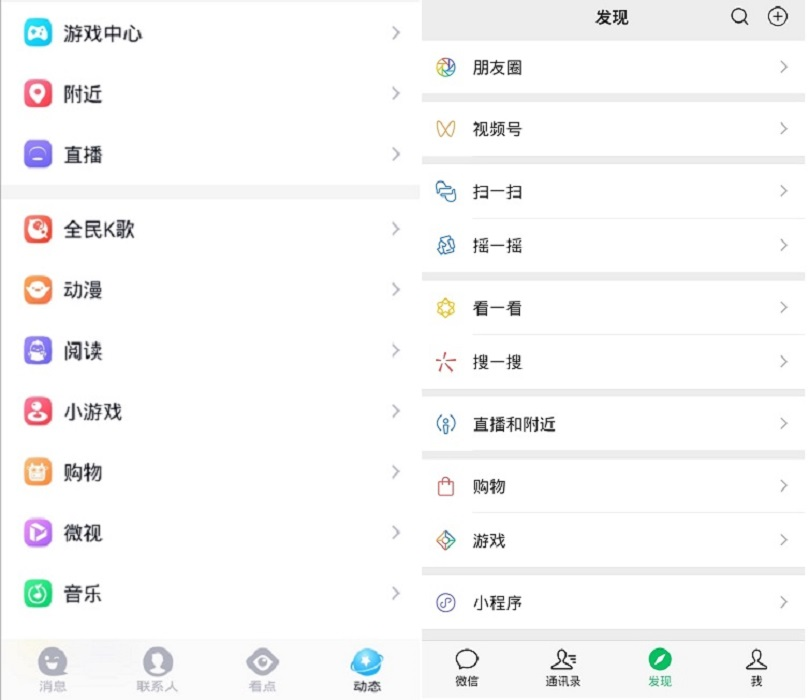
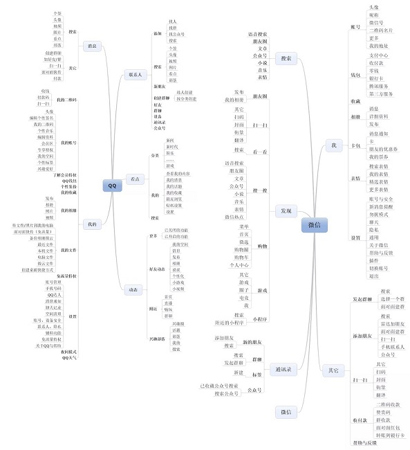
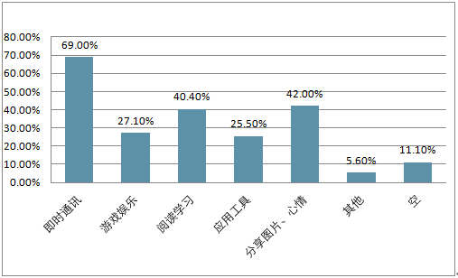

# 调研分析

### 1. 调研目的

+ 基于当下的社会背景，了解市场对于聊天软件的需求。
+ 从案例中了解到市场上已有的聊天软件的优势和不足，从而确定软件的设计方向以及改进措施。
+ 对该软件进行初步的设计，分析开发该软件的可行性。

### 2. 调研背景

#### 2.1 背景

+ 在当下这个快节奏的、人人繁忙的信息时代，人们需要社交且离不开社交，同时需要一款应用，提供与家人、朋友和同事联系的功能。如今，微信和QQ是中国用户人数最多、用户人群最广的两大社交通讯软件。
+ QQ主打社交以及各种各样宽泛的功能，微信主打"圈子内的通讯"。然而随着他们的发展，也逐渐显露出一些不足，QQ越发显得臃肿和花哨，并且让用户严重感受到开发者明显的盈利的功利性，而微信虽然在一些方面比较简洁，却让人觉得有些过于专注于圈子内部的通讯，从而减少了陌生人之间的社交，并且也多了一些不必要的功能。
+ QQ和微信的非聊天功能展示：

+ 下图为QQ和微信的产品结构图：

+ 可以看到，微信和QQ附加了许多除了社交之外其它功能，这使得整个聊天软件功能繁多，略显臃肿，对于聊天功能的专注度不是很高，比较复杂。

#### 2.2 产品定位

+ 首先，产品的定位为即时通讯社交软件。
+ 在2.1中提及的背景下，我们希望能够摒弃QQ和微信中的臃肿、多余的功能，设计一款简洁却又兼顾必要功能与一定社交性和美化的外观、且专注于用户体验的即时通讯社交软件。

#### 2.3 产品核心功能

+ 私人聊天、群聊
+ 聊天中的功能：文字、图片、文件的发送
+ 社交的功能：好友的添加，群聊的创建，朋友圈
+ 设置：个人信息和头像的选择等

### 3. 需求来源与分析

#### 3.1 需求来源：

+ 根据智研发布的《2019-2025年中国社交软件行业市场深度调研及投资战略分析报告》，社交软件最常使用的功能分布情况为：

+ 可以看到，聊天和分享图片、心情是一款社交软件最常使用的功能，其它功能用户的使用较少，在社交软件中加入这些不经常使用的功能有可能造成软件的臃肿和冗余，从而影响用户的使用体验，或者造成社交软件性能降低，所以一款简洁的只有必要功能的社交软件在市场上也有一定的需求。

#### 3.2 需求用户分析：

**3.2.1 用户人群分析**

+ 软件面向的人群是那些不想被过于繁杂的其它功能所打扰，只想专注于聊天与社交的人群。
+ 不会复杂操作的老年人，多余功能的加入可能会干扰老年人的操作，影响他们使用真正需要的功能，我们还提供了放大字体的关怀模式，让字体更大更能被看清。

**3.2.2 用户使用场景分析**

+ 许多人并不想被聊天软件频繁弹出的其它消息所困扰，比如看点、新闻之类的消息，那么就可以使用这款更加简洁的专注于聊天和社交的软件，提升聊天体验。
+ 对于有些老年人，过于多的功能有时候会使他们找不到要聊天的人和聊天窗口，使用这款更加简洁的软件，可以帮助他们更好的和别人沟通，降低操作难度。

### 四. 产品分析

**4.1 设计风格：**

+ 设计风格上应该尽量清新简洁，将主要的功能显眼的展示出来，方便用户操作，使用重要功能。
+ 图标logo也应该尽可能地简洁干净，同时包含丰富的意义，使人可以看到图标便能够想象到相应的功能或页面，方便操作。

**4.2 内容展示：**

+ 因为是聊天软件，所以消息提示也应该显眼地展示在主页上，其它功能比如分享图片等应该由底部的导航栏进行切换显示。
+ 分享图片、心情的版块可以模仿QQ空间或者微信朋友圈的风格，可以点赞，并且显示评论。
